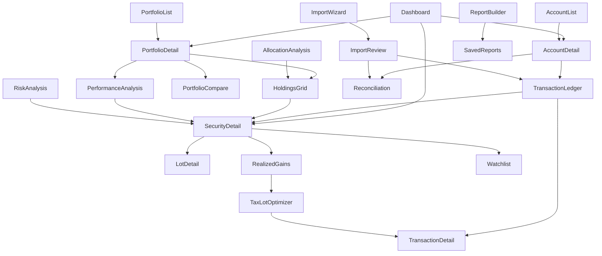

# Portfolio Manager — Desktop UX Architecture

**Author:** Lead Product Designer
**Scope:** Application-level UX architecture (pre-implementation)
**Stack:** Python, PySide6, SQLite, offline-first
**Reference class:** Bloomberg Terminal (density, keyboard-first), Morningstar Direct (analytics depth), Portfolio Performance (personal-investor clarity)

This document defines the *shape* of the application before any screen is designed in detail. Every later screen spec, wireframe, and component should trace back to a decision made here. Where a decision has real trade-offs, the reasoning is spelled out — this is meant to be arguable, not just declared.

---

## 0. Design Premises

Four premises drive almost every decision below, so they're stated up front rather than repeated 20 times:

1. **This is a tool for repeated, daily-to-weekly use by one serious user, not a dashboard glanced at once.** Optimize for muscle memory and speed over discoverability-for-first-time-users. A new user should be onboarded once, deliberately; the other 10,000 sessions should be fast.
2. **Offline-first means data is always local and always current.** There is no "syncing…" spinner blocking the UI. Network-dependent operations (price updates, statement imports) are explicit, backgroundable, and never gate access to already-known data.
3. **Financial software must never let the user lose or misinterpret data silently.** This shows up repeatedly: destructive actions are reversible or confirmed, calculations are always traceable to their inputs, and errors are specific rather than generic.
4. **Density is a feature, not a bug — but it's progressive.** A new portfolio with one account should not look like a trading desk. The same screen should be able to grow into one as the user's needs grow.

---

## 1. Overall Navigation Hierarchy

**Decision: a single persistent application shell with a fixed left sidebar (module/section navigation) and a flexible workspace area (tabs) on the right — not a wizard, not a page-per-window, not a hub-and-spoke of independent windows.**

```
┌─────────────────────────────────────────────────────────────┐
│ Menu Bar (File Edit View Portfolio Analysis Tools Window Help)│
├─────────────────────────────────────────────────────────────┤
│ Toolbar (contextual, changes with active tab)                 │
├───────────┬─────────────────────────────────────────────────┤
│           │  Tab strip: [Dashboard][NVDA][Tax 2026][+]        │
│  Sidebar  ├─────────────────────────────────────────────────┤
│  (nav     │                                                   │
│   tree)   │              Active workspace content             │
│           │                                                   │
├───────────┴─────────────────────────────────────────────────┤
│ Status bar: sync state · last import · base currency · zoom   │
└─────────────────────────────────────────────────────────────┘
```

**Hierarchy levels:**

- **Level 0 — Sidebar sections** (always visible, never nested more than one level deep): Dashboard, Portfolios, Accounts, Transactions, Holdings, Analytics, Watchlists, Tax, Reports, Import/Export, Settings.
- **Level 1 — Sidebar tree items** under sections that have multiplicity (e.g., under *Accounts*: each brokerage/account; under *Portfolios*: each user-defined portfolio/grouping).
- **Level 2 — Workspace tabs.** Clicking any Level-0/1 item opens (or focuses) a tab. Tabs are the actual navigation surface for content; the sidebar is a *launcher*, not a page-replacement control.

**Why a sidebar + tabs shell instead of alternatives:**

- *Wizard-style, one-screen-at-a-time apps* (common in consumer fintech) optimize for a single linear task (e.g., "connect a bank"). This application's core use case is cross-referencing — comparing a holding's performance against a benchmark while a transaction list is open next to it. A linear model actively fights that.
- *Pure hub-and-spoke with independent top-level windows per module* (old-school Windows MDI apps) gives power users flexibility but costs window-management overhead and makes state persistence across sessions harder to reason about. We recover most of the flexibility via **tabs that can be popped into their own window** (see §13) without paying that cost by default.
- The sidebar tree mirrors the domain model directly (Portfolios → Accounts → Holdings → Transactions), so navigation *is* a live expression of the user's data, not a separate abstraction the user has to learn.

---

## 2. Complete List of Screens

Grouped by sidebar section. Each entry notes whether it's a **singleton** (one instance, reused) or **instanced** (one tab per entity, e.g., one per holding).

### Dashboard
- **Portfolio Overview** (singleton) — net worth, allocation, day/period change, top movers.

### Portfolios
- **Portfolio List** (singleton) — all user-defined portfolios/groupings.
- **Portfolio Detail** (instanced) — holdings, performance, allocation for one portfolio.
- **Portfolio Compare** (singleton, multi-select input) — side-by-side comparison of 2+ portfolios.

### Accounts
- **Account List** (singleton) — all brokerage/bank/wallet accounts.
- **Account Detail** (instanced) — balance history, linked transactions, statements.
- **Account Reconciliation** (instanced, modal-adjacent) — compare imported balance vs. computed balance.

### Transactions
- **Transaction Ledger** (singleton, filterable) — all transactions across all accounts, spreadsheet-like grid.
- **Transaction Detail / Edit** (panel, not a full screen — see §12).
- **Import Review** (instanced per import batch) — staged transactions pending confirmation.

### Holdings
- **Holdings Grid** (singleton, filterable) — all positions across all accounts.
- **Security Detail** (instanced, one per ticker/ISIN) — price history, lots, transactions, notes.
- **Lot Detail** (panel within Security Detail) — tax-lot-level view for cost-basis methods.

### Analytics
- **Performance Analysis** (singleton, configurable) — TWR/MWR, benchmarking, drawdown.
- **Allocation Analysis** (singleton) — by asset class, sector, geography, currency.
- **Risk Analysis** (singleton) — volatility, correlation matrix, concentration.
- **Cash Flow Analysis** (singleton) — contributions, withdrawals, dividends over time.
- **Scenario / What-If** (singleton) — hypothetical trades or rebalancing.

### Watchlists
- **Watchlist List** (singleton) — all watchlists.
- **Watchlist Detail** (instanced) — securities not currently held, tracked for research.

### Tax
- **Realized Gains/Losses** (singleton, filterable by year).
- **Tax Lot Optimizer** (singleton) — assists lot selection for a pending sale.
- **Tax Document Center** (singleton) — imported/generated tax forms.

### Reports
- **Report Builder** (singleton) — configure and generate PDF/CSV reports.
- **Saved Reports** (singleton) — history of generated reports.

### Import/Export
- **Import Wizard** (modal flow, see §12) — statement/CSV import.
- **Export Center** (singleton) — data export in various formats.

### Settings
- **General, Accounts & Connections, Data & Backup, Appearance (non-color), Shortcuts, About** (singleton, tabbed within one screen).

### System-level (not in sidebar)
- **Command Palette** (overlay, see §10).
- **Global Search Results** (overlay/panel, see §10).
- **Notification Center** (overlay, see §11).
- **Conflict/Error Resolution dialogs** (modal, see §16).

---

## 3. Screen Relationships



**Reasoning:** almost every terminal screen (Security Detail, Transaction Detail) is reachable from at least three different entry points, because in real usage the user doesn't think "I'm in the Analytics module" — they think "I'm looking at NVDA" and arrive there from a chart, a holdings row, a transaction, or search. The architecture treats **Security Detail and Transaction Detail as shared destinations**, not module-owned screens, which has a direct implementation consequence: they must be built as reusable, context-agnostic panels/tabs, not embedded inside one parent screen's code.

---

## 4. User Journeys

**Journey A — Morning check-in (highest-frequency journey).**
Launch app → Dashboard loads instantly from local SQLite (no network wait) → user scans day change and top movers → clicks a mover → Security Detail opens in a new tab → glances at news/price chart → closes tab or leaves it pinned. *Design consequence:* Dashboard must render meaningfully from cache within ~200ms of launch, with price freshness quietly indicated, never blocking.

**Journey B — Monthly statement import.**
User receives a brokerage statement (CSV/PDF) → Import/Export → Import Wizard → select account, select file → parser stages transactions → Import Review shows matched vs. new vs. ambiguous rows → user resolves ambiguous rows inline → confirms → transactions land in Ledger and Holdings recompute → Reconciliation screen offered if computed balance ≠ statement balance. *Design consequence:* import is a **reviewable staging process**, never a silent bulk write (Core Principle 8: never silently discard user data).

**Journey C — Tax-loss harvesting decision.**
Tax → Realized Gains/Losses → filter unrealized by loss → select a losing lot → Tax Lot Optimizer suggests lots for a hypothetical sale → user opens Scenario/What-If to see portfolio-level impact → satisfied, navigates to broker externally to execute → returns and logs the manual transaction. *Design consequence:* the app must support **manual transaction entry** as a first-class path, not just imports, since execution happens outside the app.

**Journey D — Building a research watchlist.**
Global search for a ticker not yet held → Security Detail opens in "research mode" (no lots/cost-basis panels since there's no position) → user adds to a Watchlist from the toolbar → later, if a position is opened via import or manual entry, the same Security Detail screen gains the position-specific panels. *Design consequence:* Security Detail must be a **superset UI that reveals panels conditionally**, not two different screens (see §14).

**Journey E — Quarterly deep review.**
Analytics → Performance Analysis → set date range to quarter → compare against a benchmark → drill into Allocation Analysis for drift from target → open Report Builder → generate PDF for personal records → Saved Reports. *Design consequence:* date-range and filter state should be **shareable across Analytics screens** in a session (a global "as of" context), so the user doesn't re-set the same range five times.

---

## 5. Typical Workflows

- **Quick balance check:** Dashboard only, <10 seconds, zero clicks beyond launch.
- **Log a manual trade:** Ctrl+N (New Transaction) from anywhere → inline form → save. No forced navigation away from current context.
- **Reconcile an account after import:** Account Detail → Reconciliation tab → line-by-line diff → accept/flag discrepancies.
- **Rebalance decision:** Allocation Analysis → identify drift → Scenario/What-If → model trades → (optional) export a trade list.
- **Year-end tax prep:** Tax section end-to-end → Report Builder → Tax Document Center archive.
- **Due diligence on a new security before buying:** Global search → Security Detail (research mode) → Watchlist → set a price alert (Notifications).

---

## 6. Toolbar Layout

**Decision: a single contextual toolbar directly under the menu bar, whose content changes based on the active tab, plus a small set of persistent global actions pinned to the right edge.**

```
[≡ Sidebar] | <contextual actions for active tab>      ...      [🔍 Search] [🔔] [⟳ Sync] [⚙]
```

- **Left-anchored, contextual zone:** actions relevant to the current screen only (e.g., on Transaction Ledger: New Transaction, Import, Filter, Export selection; on Security Detail: Add to Watchlist, New Transaction, Set Alert, Compare).
- **Right-anchored, persistent zone:** Global Search, Notifications, Sync/Refresh status, Settings — identical on every screen, because these are cross-cutting concerns the user should never have to hunt for.
- **No icon-only ambiguity:** every toolbar icon has a text label at default width; icons collapse to icon-only with tooltips only below a width threshold (responsive to window resizing, not a user toggle) — professional tools should not force users to memorize icon meanings for infrequent actions.
- **Reasoning for contextual over static:** a fully static toolbar (same buttons always visible, disabled when irrelevant) is common in simpler apps but wastes horizontal space on a data-dense screen and forces users to scan past greyed-out controls constantly. Since navigation already tells the app what mode we're in, the toolbar can safely follow it. The persistent zone exists specifically to counter the risk that contextual toolbars make "always available" actions feel hidden.

---

## 7. Sidebar Layout

```
▾ DASHBOARD
▾ PORTFOLIOS
    All Portfolios
    Retirement
    Taxable — Growth
    + New Portfolio
▾ ACCOUNTS
    Fidelity 401(k)
    Schwab Brokerage
    Coinbase
    + Add Account
▾ ANALYTICS
    Performance
    Allocation
    Risk
    Cash Flow
▾ TAX
▾ WATCHLISTS
    Tech Research
    + New Watchlist
──────────────
  Reports
  Import / Export
  Settings
```

- **Structural sections (Dashboard, Analytics, Tax, Reports, Import/Export, Settings) are fixed and always present**, even when empty — they represent the *shape* of the domain, not the user's current data, so they should never disappear.
- **Data-driven sections (Portfolios, Accounts, Watchlists) expand to show the user's actual entities**, each with an inline "+ New" affordance at the bottom of its group rather than a separate "create" screen — creation should never feel like leaving navigation to go do an unrelated task.
- **Collapsible to icon rail** (like VS Code's activity bar) for users who want more workspace width; state persists across sessions per-window.
- **Right-click on any entity row opens its context menu** (§8) without requiring the row to be opened first — critical for a "manage many accounts quickly" power workflow.
- **No drag-and-drop reordering in v1** unless the user explicitly organizes portfolios into custom groups — sidebar order defaults to a sensible rule (e.g., account balance descending, or manual pin) to avoid a whole category of "why did my sidebar reorder itself" complaints; this is intentionally deferred rather than designed shallowly.

---

## 8. Context Menus

Every data row (account, holding, transaction, security) gets a right-click menu. Two design rules:

1. **The context menu is a superset of the row's default action, never a different action.** Double-click opens the item; right-click → first menu item is always "Open" doing the identical thing, so users build a consistent mental model between the two gestures.
2. **Destructive items are always separated by a divider and never first in the list.**

**Example — Transaction row:**
```
Open Transaction
Edit…
Duplicate
─────────────
Go to Security
Go to Account
─────────────
Add Note
Exclude from Analytics
─────────────
Delete…          (confirmation required)
```

**Example — Holding row:**
```
Open Security
Add Transaction (Buy/Sell)…
─────────────
Add to Watchlist
Compare With…
─────────────
View Lots
Set Price Alert…
─────────────
Hide from Dashboard
```

**Example — Sidebar Account:**
```
Open Account
Reconcile…
Rename
─────────────
Import Statement…
Export…
─────────────
Archive Account
Delete Account…  (confirmation, blocked if it has transactions unless user explicitly acknowledges data loss)
```

---

## 9. Keyboard Shortcuts

Bloomberg-class software lives or dies on keyboard efficiency. Baseline scheme (all reassignable in Settings → Shortcuts):

| Action | Shortcut | Notes |
|---|---|---|
| Command palette | `Ctrl+K` | Primary "do anything" entry point |
| Global search | `Ctrl+F` / `/` | `/` only when focus isn't in a text field |
| New transaction | `Ctrl+N` | Available from any screen |
| New tab | `Ctrl+T` | Opens a blank "go to…" tab |
| Close tab | `Ctrl+W` | Prompts if unsaved edits exist |
| Next / previous tab | `Ctrl+Tab` / `Ctrl+Shift+Tab` | |
| Jump to tab 1–9 | `Ctrl+1`…`Ctrl+9` | |
| Toggle sidebar | `Ctrl+B` | |
| Refresh/sync prices | `F5` or `Ctrl+R` | |
| Import statement | `Ctrl+I` | |
| Focus ledger filter | `Ctrl+Shift+F` | |
| Duplicate row (grid) | `Ctrl+D` | |
| Delete row (grid) | `Delete` | Always confirms |
| Save / commit edit | `Ctrl+S` / `Enter` | |
| Cancel edit | `Esc` | |
| Navigate grid rows | Arrow keys | Excel-like grid navigation throughout |
| Multi-select rows | `Shift`/`Ctrl`+click | Standard, for bulk export/tagging |
| Open in new window | `Ctrl+Shift+O` | Pops active tab out (§13) |

**Reasoning:** shortcuts are grouped so that *global* actions (new transaction, search, palette) work identically no matter which screen has focus — a power user should never have to think "am I in a screen where Ctrl+N works?" Grid navigation deliberately mirrors spreadsheet conventions since the target user already has that muscle memory from Excel/Google Sheets.

---

## 10. Search Behavior

**Two distinct mechanisms, not one, because they serve different intents:**

1. **Global Search (`Ctrl+F`/`/`) — "find data."** Fuzzy-matches across securities, accounts, transactions (by comment/payee), and portfolios. Results are grouped by entity type, ranked by recency and relevance, and pressing Enter on a result *navigates* to it (opens/focuses its tab). This is a read-oriented, navigational search.

2. **Command Palette (`Ctrl+K`) — "do a thing."** Matches against *actions* (New Transaction, Import Statement, Generate Report, Open Settings…) as well as navigation targets, similar to VS Code's palette. This is the escape hatch for any action in the app without touching the mouse, and it's the thing that lets the sidebar/toolbar stay visually simple — obscure or infrequent actions don't need a permanent home in the chrome if they're one keystroke away in the palette.

**In-context filtering (separate from both):** every grid screen (Ledger, Holdings, Realized Gains) has its own inline filter/search bar scoped to that grid's columns — this is *filtering*, not navigation, and should never be confused with Global Search by sharing its shortcut or UI treatment.

**Search does not query the network.** It only searches local SQLite data, consistent with offline-first — this keeps search latency near-zero and avoids a whole class of "search is spinning" states.

---

## 11. Notifications

**Philosophy: notifications are for things that happened, not things that might happen — and they never interrupt the current task.**

- **Notification Center** is a bell icon in the persistent toolbar zone with a badge count, opening a dismissible list (not toast popups by default, since a desktop portfolio tool is rarely the focused window all day). Toasts are reserved for **immediate feedback on a just-performed action** (e.g., "12 transactions imported" appears briefly after Import Review is confirmed) — that's confirmation, not a notification.
- **Categories:** Price alerts triggered, import completed/failed, reconciliation discrepancy found, scheduled report generated, data backup completed/failed.
- **Severity levels visually distinguished but never modal:** informational (import succeeded), attention (reconciliation mismatch found), warning (backup failed) — even warnings sit in the Notification Center rather than forcing a dialog, *except* data-integrity warnings that affect what the user is about to do (handled as inline banners, see §16).
- **No notification is the only record of an event.** Every notification links to the underlying screen/row where the full information persists (e.g., an import notification links to that Import batch's history) — because a dismissed toast should never be the only place a fact lived, per Core Principle 8.

---

## 12. Dialog Philosophy

**Rule of thumb: modal dialogs are reserved for decisions that must be resolved before the app can safely continue; everything else is inline or a docked panel.**

- **Modal (blocking) dialogs, used sparingly:**
  - Destructive confirmations (delete account/transaction).
  - Data-loss warnings (closing a tab with unsaved edits).
  - The Import Wizard's file-selection step (a genuinely linear, one-time-per-import flow).
  - Irreversible or hard-to-reverse settings changes (changing base currency, changing cost-basis method retroactively).

- **Non-modal / inline panels, used by default:**
  - **Transaction Detail/Edit** opens as a slide-in side panel over the Ledger, not a dialog — so the user retains visual context of the row they're editing and surrounding rows, and can click away to cancel without a modal "are you sure" (since it autosaves as a draft, and only *committing* requires the explicit Save).
  - **New Transaction** is the same panel, empty, invoked from anywhere via `Ctrl+N`.
  - **Filters** are inline popovers anchored to their trigger, not dialogs.
  - **Reconciliation** is a full inline screen (not a dialog) because it can involve extended back-and-forth review, which a modal would make claustrophobic and would block all other navigation unnecessarily.

- **Import Review is a hybrid:** a dedicated tab (not modal) so the user can cross-reference the Ledger or Security Detail *while* reviewing an import, but it behaves like a checklist the user is expected to complete before the batch is considered "done" (indicated with a persistent badge on its tab, not by blocking).

**Reasoning:** the single biggest UX failure mode in financial software is a modal dialog that blocks the user from checking something they need to see in order to make the decision the dialog is asking them to make (e.g., "confirm this transaction category?" while the account it belongs to isn't visible). Defaulting to inline/panel patterns and reserving true modals for genuinely irreversible or linear moments avoids that trap structurally rather than case-by-case.

---

## 13. Multi-Window vs. Single-Window Decisions

**Decision: single-window by default, with an explicit "pop out" escape hatch — not native multi-window, not forced single-window.**

- By default, all navigation happens within one main window's tab strip (per §1). This keeps window management simple for the majority of sessions and matches how most modern productivity tools (browsers, IDEs) behave.
- **Any tab can be popped into its own OS-level window** via `Ctrl+Shift+O` or drag-out-of-tab-strip (a pattern users already know from browsers) — this matters specifically for multi-monitor power users who want, e.g., Performance Analysis on one screen and the Ledger on another while they reconcile a statement.
- Popped-out windows remain full peers: they keep their own toolbar, retain their tab if the user drags more tabs into them, and can be dragged back into the main window.
- **We do not support fully independent multi-document windows (e.g., File → New Window with a whole separate navigation shell)** in v1 — that pattern (common in older financial desktop software) creates state-synchronization complexity disproportionate to the benefit, since almost everything a second window would show is already reachable as a tab or pop-out from the first.

---

## 14. Progressive Disclosure Strategy

Applied at three levels:

1. **Screen level — Security Detail as the canonical example.** A security with no position shows: price chart, fundamentals, news, "Add to Watchlist," "Buy." Once a position exists, additional panels *appear* (not navigate-to): Holdings/Lots, Cost Basis, Realized/Unrealized Gain, Dividend History. The screen never shows empty panels for data that structurally can't exist yet (Core Principle: don't show what isn't real).

2. **Feature level — Advanced Analytics gated behind explicit opt-in, not account tenure.** Risk Analysis (correlation matrices, VaR-style metrics) is reachable from the sidebar for every user, but its default view is the simplest useful chart; a "Show advanced metrics" toggle within the screen reveals denser statistical panels. This avoids a common failure mode of progressive disclosure — hiding power features behind onboarding gates that annoy returning power users — by keeping the *reveal* per-screen and user-controlled rather than time-gated.

3. **Data-entry level — Transaction form.** Default form shows Date, Type, Security, Quantity, Price, Account. An "Advanced" expander reveals Fees, Currency/FX rate override, Tax lot selection, Notes, Tags — fields most transactions don't need but which must never be *unavailable*, per Core Principle 6 (data integrity above everything: a user must always be able to record the actual transaction, not an approximation of it).

---

## 15. Empty States

Every empty state follows the same three-part pattern: **what this screen is for → why it's empty right now → the one action that fixes it.** Never a bare "No data."

- **First launch, no accounts at all:** Dashboard shows a single centered panel: "Add your first account to see your portfolio here" with two buttons — *Import a Statement* and *Add Account Manually* — not a generic "Get Started" wizard that hides the two real paths.
- **Account with no transactions yet:** Ledger shows "No transactions in [Account] yet" with *Import Statement* and *Add Transaction* actions, plus a muted note that balances will populate once transactions exist.
- **Watchlist with no securities:** shows a search box inline ("Search for a security to add") rather than sending the user elsewhere.
- **Analytics screens with insufficient history** (e.g., Performance Analysis with <1 data point): explicitly states *why* ("Performance requires at least one priced holding over more than one day") rather than rendering a blank/broken chart — this is a data-integrity-adjacent decision: a chart that looks empty due to a rendering issue vs. one that's empty because the math genuinely has nothing to show must never be visually indistinguishable.
- **Search/filter with no results:** always distinguishes "no data exists" from "your filter matched nothing," with a one-click "Clear filter" in the latter case.

---

## 16. Error States

Three tiers, escalating in visibility, deliberately proportional to consequence:

1. **Inline field-level errors** (form validation): red text directly under the field, form remains editable, nothing is discarded. E.g., "Quantity must be greater than zero."
2. **Inline banner errors** (screen-level, non-blocking): a dismissible colored banner at the top of the affected panel — used for things like "3 of 50 imported rows could not be matched to a security" — with a direct link/action to resolve, and the rest of the screen remains usable.
3. **Blocking error dialogs** (rare, reserved for true system-level failures): database write failure, disk-full during backup, corrupted import file that can't be parsed at all. These always state what happened, what (if anything) was saved vs. not saved, and offer a concrete next step (retry, view log, contact support/report bug) — never a bare stack trace, though a "Copy diagnostic details" option is always present for support purposes.

**Cross-cutting rule (Core Principle 8 in practice):** no error path may silently drop user input. A failed import leaves the original file untouched and stages nothing; a failed manual-transaction save keeps the form populated with the user's entries so nothing has to be retyped; a failed bulk edit reports exactly which rows succeeded and which didn't, never an ambiguous "something went wrong."

---

## 17. Loading Behavior

Because the app is offline-first, "loading" almost always means one of two very different things, and the UI must visually distinguish them:

- **Reading local SQLite data** — should be near-instant (<100ms target). If a screen ever needs a spinner for local data, that's treated as a performance bug, not a UX state to design around.
- **Fetching external data** (live prices, statement downloads, market news) — always shown as a small, localized, non-blocking indicator (e.g., a subtle pulsing dot next to "Last updated 2 min ago" in the status bar, or a spinner scoped to just the price column of a grid) — never a full-screen loading state, because the rest of the screen's data is already valid and usable from cache.
- **Long-running local computation** (recalculating performance across a large multi-decade portfolio, generating a report): a determinate progress indicator when the work is chunkable, with the screen remaining interactive for unrelated actions where possible; genuinely blocking-by-necessity operations (e.g., a database migration on first launch after an update) get a modal progress dialog explicitly because the app's data integrity requires it to finish uninterrupted.
- **Skeleton screens over spinners** for any load exceeding ~300ms on first paint (e.g., opening a Security Detail tab for a ticker with years of history) — because it communicates the *shape* of the answer arriving, consistent with treating the user as someone who will look at this screen thousands of times and benefits from predictable layout even mid-load.

---

## 18. Power-User Workflows

Specific affordances aimed at the experienced daily user, since this is the primary persona (Premise 1):

- **Bulk operations everywhere grids appear:** multi-select rows → bulk tag, bulk export, bulk exclude-from-analytics, bulk delete (with confirmation summarizing count and scope).
- **Saved views/filters** on every grid screen (Ledger, Holdings, Realized Gains): the user can save a named filter+sort+column configuration and recall it from a dropdown, and optionally pin one as that screen's default.
- **Column customization** on all grids (show/hide, reorder, resize) with per-screen persistence.
- **Keyboard-only transaction entry:** the New Transaction panel is fully tab/enter navigable with autocomplete on the security field, so a user reconciling a large statement manually never needs the mouse.
- **Command palette as a scripting-adjacent surface:** power actions like "Recalculate all performance" or "Rebuild search index" live in the palette rather than cluttering menus, discoverable by typing rather than hunting a menu tree.
- **Multi-monitor pop-out tabs** (§13) explicitly in service of this persona.
- **Comparison mode** (Portfolio Compare, Security Compare) as first-class screens, not an afterthought bolted onto detail views — comparison is a daily activity for this user, not an edge case.

---

## 19. Accessibility Considerations

- **Full keyboard operability is treated as a correctness requirement, not an accessibility add-on** — every action reachable by mouse (including context menu items) must have a keyboard path, which falls naturally out of the Command Palette's design (§10) but must be verified per-screen regardless.
- **Screen reader support via Qt's accessibility framework:** every custom-drawn widget (charts, custom grid cells) needs an accessible name/description exposed through `QAccessible`, since PySide6 does not give this for free on anything beyond standard widgets — this is a concrete engineering obligation flowing from a UX decision, flagged here so it's budgeted for rather than discovered late.
- **Never encode meaning by color alone.** Gains/losses, alerts, and status indicators pair color with an icon or text label (e.g., ▲/▼ alongside green/red) — relevant both for colorblind users and because this document explicitly defers color decisions, so every state must be legible in a colorless mock.
- **Scalable typography and layout:** the UI respects system/application-level font-scaling without breaking grid layouts or truncating critical financial figures — a currency value silently truncated by a font-scaling change would be a data-integrity-adjacent failure, not just a cosmetic one.
- **Focus indicators are always visible**, including in dense grids, and tab order follows visual/logical order on every screen, verified per-screen at implementation time rather than assumed from layout.
- **Timing:** no functionality (toasts, tooltips) depends on the user acting within a fixed short window; toasts persist until dismissed or replaced rather than auto-expiring during a critical read.

---

## 20. Future Scalability for Additional Modules

The architecture is deliberately built so new modules slot into existing structure rather than requiring new navigation paradigms:

- **New asset classes** (e.g., real estate, private equity, collectibles) become new entity types under Portfolios/Accounts/Holdings, reusing the existing Security Detail / Holdings Grid pattern rather than needing parallel screens — the domain model, not the UI, absorbs the complexity.
- **New analytics modules** (e.g., Monte Carlo retirement projections, factor exposure analysis) are new sidebar items under Analytics, inheriting the shared "as of" date-range context (§4, Journey E) for free.
- **Multi-user/household support**, if ever added, extends the Portfolios grouping concept (a portfolio already groups accounts; a household would group portfolios) rather than requiring a new hierarchy level.
- **Plugin/extension modules** (per the Clean Architecture's Plugins layer) get a dedicated, clearly demarcated sidebar section ("Extensions") rather than being interleaved into core navigation, so a third-party module is never visually indistinguishable from a core one — important for trust in an eventual open-source context.
- **Cloud sync (if ever introduced) does not change this architecture** — it would surface as a new status-bar indicator and a Settings section, not a new navigation paradigm, because the offline-first premise means the UI was never built to assume connectivity in the first place.

---

## Summary Table — Decision Reasoning at a Glance

| Area | Decision | Primary reason |
|---|---|---|
| Shell | Sidebar + tabs, single window | Supports cross-referencing; avoids window-management overhead |
| Toolbar | Contextual + persistent zone | Density without hiding global actions |
| Search | Two mechanisms (find vs. do) | Different intents need different UX, not one overloaded box |
| Dialogs | Inline/panel by default, modal only when irreversible | Prevents blocking users from info they need to decide |
| Windows | Single by default, pop-out on demand | Simplicity by default, power on request |
| Disclosure | Per-screen, data- or user-triggered, never tenure-gated | Doesn't punish returning power users |
| Loading | Local = instant, remote = localized indicator | Matches offline-first premise honestly |
| Errors | Tiered, always specific, never silently discards input | Core Principle 8 in every path |

---

*This document defines structure and reasoning only, per scope. Individual screen wireframes, component specifications, and the design-token/visual system are separate deliverables to follow, built against this architecture.*
